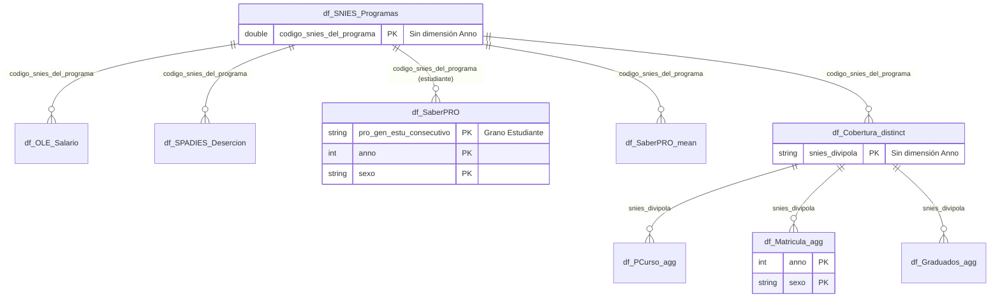

# Documentación Técnica: SNIES Data Lake (OEDE)

Este documento describe la arquitectura relacional del Data Lake de archivos Parquet del SNIES, detallando las reglas de granularidad y dimensiones de desglose.

## 1. Estructura Lógica y Granularidad
El modelo se divide en bloques funcionales con diferentes niveles de detalle:

### Bloque 1: Resultados (Salida)
- **Granularidad**:
    - `df_SaberPRO`: **Nivel Individuo** (un registro por estudiante). Única tabla con este detalle.
    - Resto de tablas (OLE, SPADIES, SaberPRO_mean): **Nivel Programa**.
- **Dimensiones de Desglose**: Las tablas OLE (Salario/Movilidad) y SaberPRO incluyen la dimensión **Sexo**.
- **Temporalidad**: Todas incluyen la columna `anno`.

### Bloque 2: Dimensiones Maestras (Núcleo)erDiagram
    %% Lado Izquierdo: Relaciones directas con el Programa
    df_SNIES_Programas ||--o{ df_OLE_Salario : "codigo_snies_del_programa"
    df_SNIES_Programas ||--o{ df_OLE_Salario_M0 : "codigo_snies_del_programa"
    df_SNIES_Programas ||--o{ df_OLE_Movilidad : "codigo_snies_del_programa"
    df_SNIES_Programas ||--o{ df_OLE_Movilidad_M0 : "codigo_snies_del_programa"
    df_SNIES_Programas ||--o{ df_SPADIES_Desercion : "codigo_snies_del_programa"
    df_SNIES_Programas ||--o{ df_SPADIES_Retencion : "codigo_snies_del_programa"
    df_SNIES_Programas ||--o{ df_SaberPRO : "codigo_snies_del_programa"
    df_SNIES_Programas ||--o{ df_SaberPRO_mean : "codigo_snies_del_programa"

    %% Centro: Conexión SNIES -> Cobertura
    df_SNIES_Programas ||--o{ df_Cobertura_distinct : "codigo_snies_del_programa"

    %% Lado Derecho: Relaciones a través de Cobertura
    df_Cobertura_distinct ||--o{ df_PCurso_agg : "snies_divipola"
    df_Cobertura_distinct ||--o{ df_Matricula_agg : "snies_divipola"
    df_Cobertura_distinct ||--o{ df_Graduados_agg : "snies_divipola"

    df_SNIES_Programas {
        double codigo_snies_del_programa PK
        string programa_academico
        string nombre_institucion
    }

    df_Cobertura_distinct {
        string snies_divipola PK
        double codigo_snies_del_programa FK
        string municipio_oferta
    }

    df_Matricula_agg {
        string snies_divipola FK
        int anno
        double matricula_sum
    }

- **Granularidad**: **Nivel Programa**.
- **Temporalidad**: Estas son las **únicas tablas sin desglose anual**. Representan el estado actual o maestro del programa y su oferta geográfica.
    - `df_SNIES_Programas`
    - `df_Cobertura_distinct`

### Bloque 3: Operación (Matrícula)
- **Granularidad**: **Nivel Programa-Municipio** (vía `snies_divipola`).
- **Dimensiones de Desglose**: Incluyen la dimensión **Sexo**.
- **Temporalidad**: Todas incluyen la columna `anno`.

---

## 2. Diagrama de Entidad-Relación (Mermaid)

---

## 3. Matriz de Dimensiones para el Programador

| Tabla | Grano | Filtro Sexo | Filtro Año | Cruce Principal |
| :--- | :--- | :---: | :---: | :--- |
| `df_SNIES_Programas` | Programa | No | **No** | `codigo_snies_del_programa` |
| `df_Cobertura_distinct` | Programa-Municipio | No | **No** | `snies_divipola` |
| `df_Matricula_agg` | Programa-Municipio | **Sí** | Sí | `snies_divipola` |
| `df_OLE_Salario` | Programa | **Sí** | Sí | `codigo_snies_del_programa` |
| `df_SaberPRO` | **Estudiante** | **Sí** | Sí | `codigo_snies_del_programa` |
| `df_SPADIES_Desercion` | Programa | No | Sí | `codigo_snies_del_programa` |

---

## 4. Guía de Navegación
- **Para Matrículas**: `Programas` -> `Cobertura` -> `Matrícula (Filtrar por Anno y Sexo)`.
- **Para Calidad**: `Programas` -> `SaberPRO (Filtrar por Anno y Sexo)`.
- **Importante**: Al unir tablas con dimensión `sexo` y `anno`, asegúrese de incluirlas en el JOIN o realizar el filtrado antes del cruce para evitar explosión de registros (Cross-join accidental).
